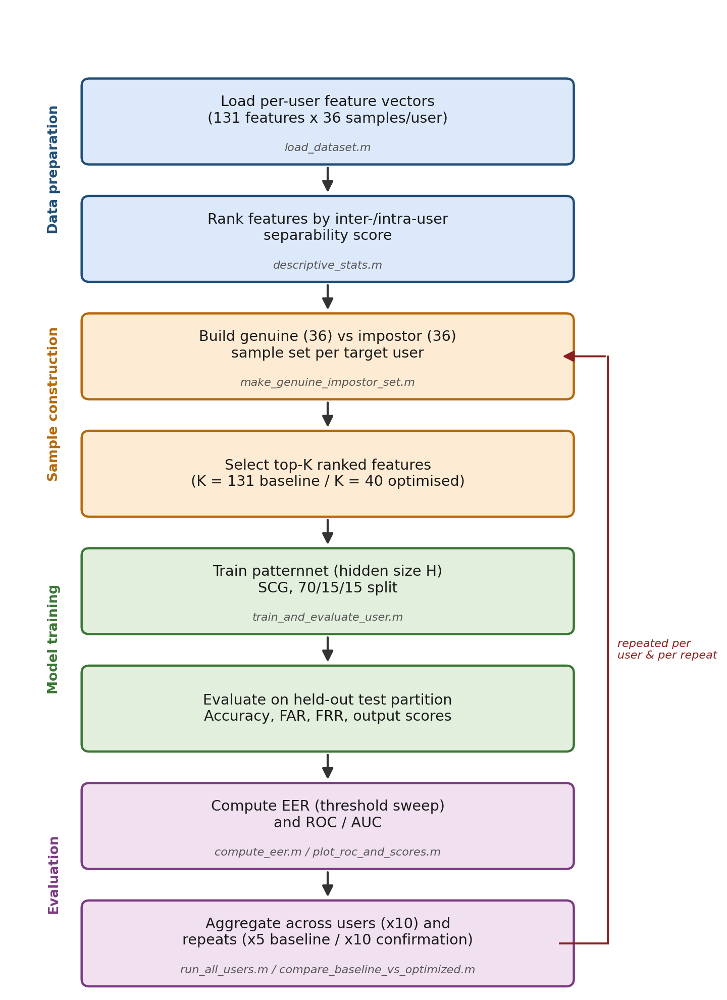
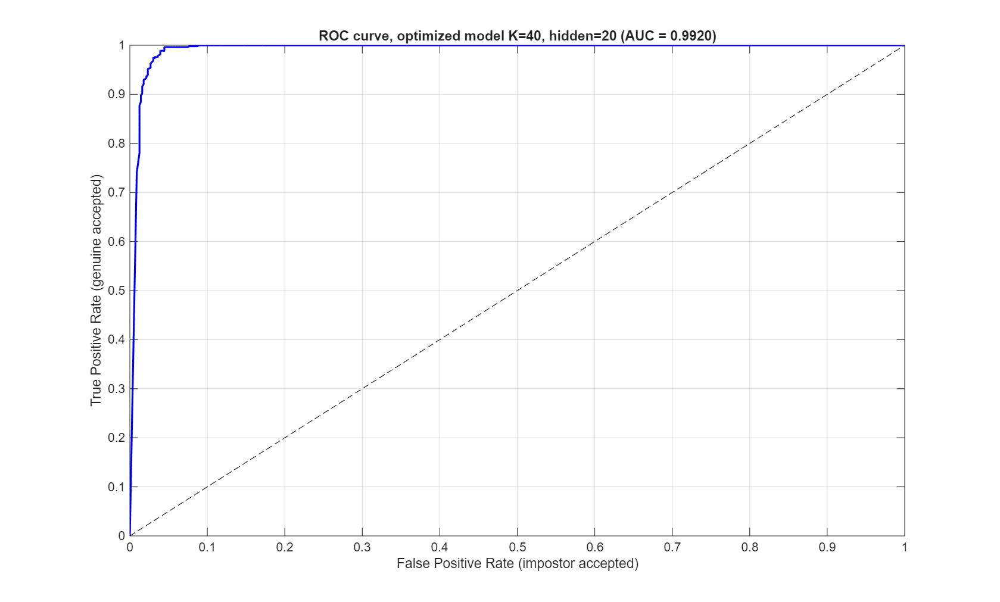
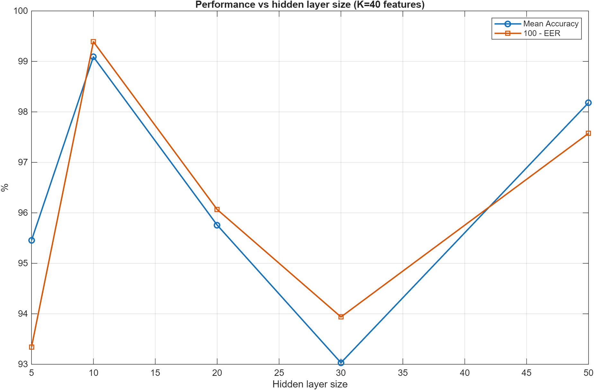

# Acceleration-Based User Authentication


Coursework project for **PUSL3123 – Artificial Intelligence & Machine Learning** (Referrals), University of Plymouth.

A behavioural-biometric authentication system that verifies a user's identity from wrist-accelerometer motion, using a per-user neural network classifier evaluated with standard biometric error metrics.

---

## Contents

- [Overview](#overview)
- [Results at a Glance](#results-at-a-glance)
- [Methodology](#methodology)
- [Project Structure](#project-structure)
- [Scripts](#scripts)
- [Sample Output](#sample-output)
- [Requirements](#requirements)
- [Author](#author)

---

## Overview

Each of 10 users carried an accelerometer across two recording sessions. From the raw motion, 131 time-domain and frequency-domain features are extracted per sample. A feedforward neural network is trained **per user** to separate that user's genuine samples from impostor samples drawn from the other 9 users, then evaluated with:

- **FAR** — False Acceptance Rate (impostors wrongly let in)
- **FRR** — False Rejection Rate (genuine user wrongly rejected)
- **EER** — Equal Error Rate, the point where FAR = FRR (lower is better)

Beyond the baseline classifier, the project also explores feature-domain contribution (time vs. frequency), same-day vs. cross-day generalisation, DTW-based user similarity, and network architecture sensitivity.

## Results at a Glance

| Stage | Configuration | Accuracy | FAR | FRR | EER |
|---|---|---:|---:|---:|---:|
| Baseline | 131 features, hidden=10 | 98.00% | 3.44% | 0.90% | 1.82% |
| Feature sweep | Top‑90 ranked features | 97.88% | 2.82% | 0.67% | 3.03% |
| Hidden-size sweep | hidden=10 | 99.09% | 0.42% | 1.08% | **0.61%** |
| Confirmed (10 repeats) | K=40, hidden=10 | 96.91% ± 6.98 | 4.31% | 2.42% | 3.18% |
| Confirmed (10 repeats) | K=40, hidden=20 | 97.45% ± 5.79 | 4.55% | 0.84% | 3.26% |

Full sweep tables, per-user breakdowns, and the extended domain/cross-day/DTW analysis are in [`report/console_log.txt`](report/console_log.txt) and the figures under [`report/graphs/`](report/graphs/).

## Methodology

1. **Load** per-user accelerometer feature vectors (time-domain + frequency-domain, two sessions each).
2. **Construct** genuine/impostor sample sets per user.
3. **Train** a feedforward pattern-recognition neural network to classify genuine vs. impostor.
4. **Evaluate** with accuracy, FAR, FRR, and EER.
5. **Optimise** by sweeping feature-set size (top-K ranked features) and hidden-layer size, then confirm the best configuration with repeated trials.
6. **Extend** the analysis: per-domain contribution (time-only / frequency-only / combined), same-day vs. cross-day generalisation, DTW-based inter-user similarity, and network architecture benchmarking.

## Project Structure

```
data/       Raw per-user accelerometer feature sets (10 users; time-domain,
            frequency-domain, and combined time+frequency-domain feature
            vectors, across two recording sessions per user)
scripts/    MATLAB pipeline (see below)
results/    Saved .mat outputs from the experiments
report/     Report drafts (Word files are git-ignored), exported graphs,
            and the full console log
```

## Scripts

### Core pipeline

| Script | Purpose |
|---|---|
| `load_dataset.m` | Loads all users' feature data into a single struct |
| `make_genuine_impostor_set.m` | Builds a genuine/impostor sample set for a target user |
| `descriptive_stats.m` | Exploratory feature statistics and plots |
| `train_baseline_nn.m` | Trains a baseline neural network authentication model |
| `train_and_evaluate_user.m` | Trains/evaluates a per-user model (accuracy, FAR, FRR, scores) |
| `compute_eer.m` | Computes the Equal Error Rate from genuine/impostor scores |
| `run_all_users.m` | Runs the baseline pipeline across all 10 users with repeated trials |
| `run_feature_selection_sweep.m` | Sweeps feature-set size (top-K ranked features) to find the best K |
| `run_hyperparam_sweep.m` | Sweeps hidden-layer size to find the best network configuration |
| `confirm_hidden_size.m` | Confirmation runs comparing shortlisted hidden-layer sizes |

### Extended analysis

| Script | Purpose |
|---|---|
| `load_all_domains.m` / `build_domain_impostor_set.m` | Load and pair samples per feature domain (time / frequency / combined) |
| `run_domain_timeD.m` / `run_domain_freqD.m` / `run_domain_timeD_freqD.m` | Per-domain evaluation runs |
| `run_single_domain_comparison.m` / `run_domain_split_comparison.m` / `plot_domain_split_full_metrics.m` | Compare domains against each other |
| `plot_domain_variance_breakdown.m` | Visualise variance contribution per domain |
| `train_eval_generic.m` / `train_eval_crossday.m` | Same-day vs. cross-day generalisation evaluation |
| `run_ratio_sweep_domain.m` / `run_ratio_sweep_all_domains.m` / `run_ratio_timeD.m` / `run_ratio_freqD.m` / `run_ratio_timeD_freqD.m` | Genuine/impostor ratio sweeps per domain |
| `compute_dtw_distance_matrix.m` | Dynamic Time Warping distance matrix between users |
| `compute_fday_mday_similarity.m` | Within-user first-day vs. mid-day similarity |
| `benchmark_nn_architecture.m` / `plot_validation_performance.m` | Network architecture and training benchmarking |
| `compare_baseline_vs_optimized.m` / `plot_roc_and_scores.m` | Baseline vs. optimised model comparison, ROC and score distributions |
| `compute_full_metrics.m` | Shared metric computation used across the sweeps above |

## Sample Output

<p align="center">
  
</p>
<p align="center">
  
  
</p>

## Requirements

- MATLAB with the Deep Learning Toolbox (for `patternnet` / `train`)

## Author

**Punuja Lokith** — sole contributor
